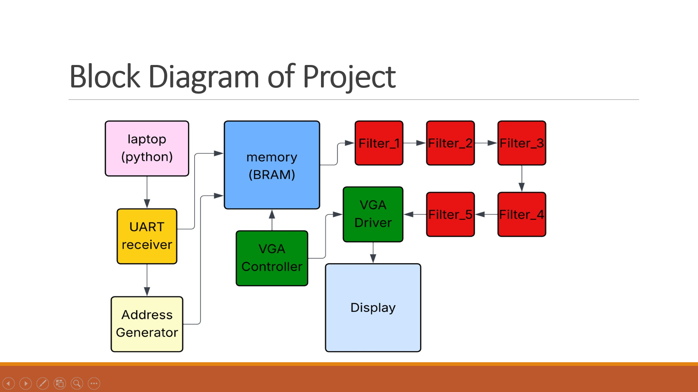

# Image Processing On FPGA 📸

This is the official repository for the Image Processing on FPGA project created at IvLabs, VNIT Nagpur. The aim of this project is to develop a custom, hardware-accelerated photo viewer and image processor that runs on an FPGA development board.

## Project Overview

The system takes a digital image from a computer, saves it in the FPGA’s internal memory, applies various filters, and sends the outcome to a VGA monitor.

Key Functionality

**Image Input:** A Python program on a PC transmits QVGA (320x240) image data (RGB444) through USB-to-UART (Universal Asynchronous Receiver-Transmitter).

**On-Chip Storage:** The FPGA employs a Dual-Port Block RAM (BRAM) for storing the entire image frame.

**Display & Filtering:** A custom VGA Controller retrieves the saved image and shows it on a monitor (640x480 @ 60 Hz), scaling the QVGA image to fit the screen.

**Mode Control:** A physical display switch changes the state of the FPGA: * Switch OFF: Receive Mode (the FPGA listens to UART and writes data to the memory). * Switch ON: Display Mode (the FPGA stops receiving data and continuously shows the stored image).

**Filter Application:** Various filters, including Convolution (like Blur), can be applied simultaneously using dedicated hardware logic controlled by slide switches.

**Tools and Technologies**

## Category Component/Language Details

Hardware Basys 3 FPGA Board

Target board (Xilinx Artix-7, xc7a35t-1).

HDL Verilog

Used for all Register-Transfer Level (RTL) design.

Software AMD Vivado Design Suite

For synthesis, implementation, and simulation.

PC Scripts Python (OpenCV, PySerial)

Used for image resizing, RGB sampling, and sending pixel data via UART.

Protocols UART & VGA

For data transmission and video display, respectively.

## RTL Design Modules

The core functions are built using several interconnected Verilog modules:

**UART_Rx:** This module receives serial data bytes from the computer.

**Pixel_Compiler:** It merges three consecutive 4-bit bytes (R, G, B) into a single 12-bit RGB444 pixel value, utilizing a Finite State Machine (FSM).

**DualPort_RAM:** Manages the on-chip BRAM for dual operations: writing (receive mode) and reading (display mode).

**VGA_Controller:** Generates timing signals (VSync, HSync, Pixel_Clock) necessary for the 640x480 @ 60 Hz display standard.

**LineBuffer:** Implements FIFO (First-In, First-Out) registers to temporarily store neighboring pixels (a 3x3 window) needed for convolution operations.

**Convolution:** Conducts matrix multiplication on the buffered pixel window to apply filters like blurring.

**Top_Module:** Instantiates and connects all the submodules, managing memory addresses and providing the final VGA output signals.

## Testing and Verification

The project includes steps for behavioral simulation and hardware testing:

**Convolution Test:** Behavioral simulations are run on grayscale images to confirm the functionality of the Convolution module before full integration.

**Peripherals Test:** Uses the built-in self-tests of the Basys 3 to ensure that the slide switches, UART data transmission, and VGA output are working correctly.

 For further information visit([HackMD](https://hackmd.io/@Ash-Fpga/SJgLLpiOe-l))
